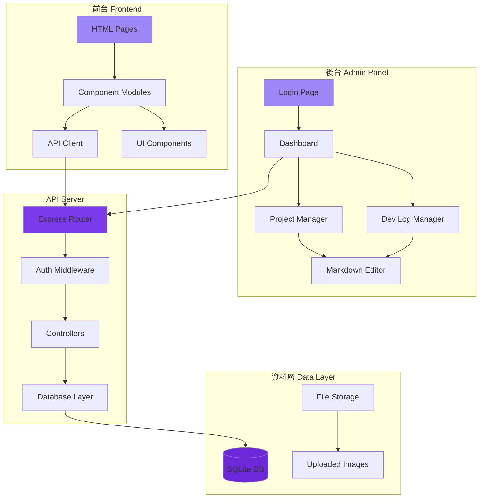
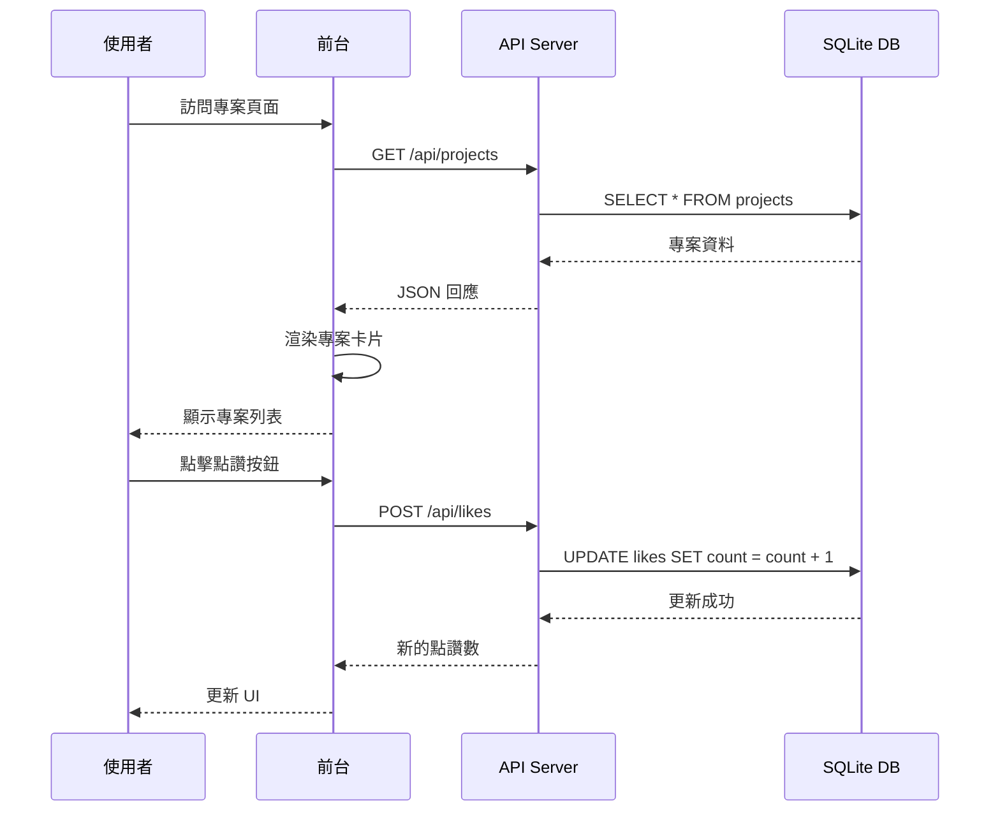

# 設計文件

## 概述

本系統是一個全端的個人作品集與開發紀錄網站，包含前台展示網頁和後台管理系統。前台使用純 HTML、CSS 和 JavaScript 開發，採用模組化架構設計。後台使用 Node.js + Express 作為 API 伺服器，SQLite 作為資料庫。系統支援 JWT 身份驗證、Markdown 內容編輯和點讚互動功能。

### 技術棧

**前端：**
- HTML5、CSS3、JavaScript (ES6+)
- 外部套件（透過 CDN）：
  - AOS (Animate On Scroll) - 捲動動畫
  - Font Awesome - 圖示庫
  - Marked.js - Markdown 解析器
  - Highlight.js - 程式碼語法高亮
  - Particles.js - 背景粒子效果

**後端：**
- Node.js + Express.js
- SQLite3
- jsonwebtoken (JWT)
- bcrypt (密碼加密)
- multer (檔案上傳)

## 系統架構

### 整體架構圖



### 目錄結構

```
portfolio-website/
├── frontend/
│   ├── index.html              # 首頁
│   ├── about.html              # 關於我
│   ├── projects.html           # 專案作品
│   ├── project-detail.html     # 專案詳情
│   ├── devlog.html             # 開發紀錄
│   ├── css/
│   │   ├── main.css            # 主要樣式
│   │   ├── components.css      # 元件樣式
│   │   └── responsive.css      # 響應式樣式
│   ├── js/
│   │   ├── components/
│   │   │   ├── navbar.js       # 導航列元件
│   │   │   ├── footer.js       # 頁尾元件
│   │   │   └── project-card.js # 專案卡片元件
│   │   ├── api.js              # API 客戶端
│   │   ├── utils.js            # 工具函式
│   │   └── main.js             # 主要邏輯
│   └── assets/
│       └── images/             # 靜態圖片
├── admin/
│   ├── login.html              # 登入頁面
│   ├── dashboard.html          # 後台首頁
│   ├── project-editor.html     # 專案編輯器
│   ├── devlog-editor.html      # 開發紀錄編輯器
│   ├── css/
│   │   └── admin.css           # 後台樣式
│   └── js/
│       ├── auth.js             # 認證邏輯
│       ├── editor.js           # Markdown 編輯器
│       └── admin-api.js        # 後台 API 客戶端
├── backend/
│   ├── server.js               # Express 伺服器入口
│   ├── config/
│   │   └── database.js         # 資料庫配置
│   ├── middleware/
│   │   └── auth.js             # JWT 驗證中介層
│   ├── routes/
│   │   ├── auth.js             # 認證路由
│   │   ├── projects.js         # 專案路由
│   │   ├── devlogs.js          # 開發紀錄路由
│   │   └── likes.js            # 點讚路由
│   ├── controllers/
│   │   ├── authController.js
│   │   ├── projectController.js
│   │   ├── devlogController.js
│   │   └── likeController.js
│   ├── models/
│   │   └── db.js               # 資料庫模型
│   └── uploads/                # 上傳檔案目錄
└── database/
    ├── portfolio.db            # SQLite 資料庫檔案
    └── init.sql                # 資料庫初始化腳本
```

## 資料模型

### 資料庫 Schema

```sql
-- 使用者表
CREATE TABLE users (
    id INTEGER PRIMARY KEY AUTOINCREMENT,
    username TEXT UNIQUE NOT NULL,
    password_hash TEXT NOT NULL,
    created_at DATETIME DEFAULT CURRENT_TIMESTAMP
);

-- 專案表
CREATE TABLE projects (
    id INTEGER PRIMARY KEY AUTOINCREMENT,
    title TEXT NOT NULL,
    description TEXT,
    content TEXT,  -- Markdown 格式
    technologies TEXT,  -- JSON 陣列字串
    thumbnail_url TEXT,
    demo_url TEXT,
    repo_url TEXT,
    created_at DATETIME DEFAULT CURRENT_TIMESTAMP,
    updated_at DATETIME DEFAULT CURRENT_TIMESTAMP
);

-- 開發紀錄表
CREATE TABLE dev_logs (
    id INTEGER PRIMARY KEY AUTOINCREMENT,
    title TEXT NOT NULL,
    content TEXT NOT NULL,  -- Markdown 格式
    category TEXT,
    tags TEXT,  -- JSON 陣列字串
    created_at DATETIME DEFAULT CURRENT_TIMESTAMP,
    updated_at DATETIME DEFAULT CURRENT_TIMESTAMP
);

-- 點讚表
CREATE TABLE likes (
    id INTEGER PRIMARY KEY AUTOINCREMENT,
    item_type TEXT NOT NULL,  -- 'project' 或 'devlog'
    item_id INTEGER NOT NULL,
    count INTEGER DEFAULT 0,
    UNIQUE(item_type, item_id)
);

-- 圖片表
CREATE TABLE images (
    id INTEGER PRIMARY KEY AUTOINCREMENT,
    filename TEXT NOT NULL,
    filepath TEXT NOT NULL,
    item_type TEXT,  -- 'project' 或 'devlog'
    item_id INTEGER,
    uploaded_at DATETIME DEFAULT CURRENT_TIMESTAMP
);
```

### 資料流程圖



## 元件設計

### 前台元件

#### 1. Navbar Component (導航列元件)

**功能：**
- 顯示網站 Logo 和導航連結
- 突顯當前頁面
- 響應式漢堡選單（行動裝置）
- 固定在頁面頂部

**介面：**
```javascript
// navbar.js
class Navbar {
    constructor(containerId, currentPage) {
        this.container = document.getElementById(containerId);
        this.currentPage = currentPage;
        this.render();
        this.attachEvents();
    }
    
    render() {
        // 渲染導航列 HTML
    }
    
    attachEvents() {
        // 綁定漢堡選單事件
    }
}
```

#### 2. Footer Component (頁尾元件)

**功能：**
- 顯示版權資訊
- 社群媒體連結
- 快速導航連結

**介面：**
```javascript
// footer.js
class Footer {
    constructor(containerId) {
        this.container = document.getElementById(containerId);
        this.render();
    }
    
    render() {
        // 渲染頁尾 HTML
    }
}
```

#### 3. Project Card Component (專案卡片元件)

**功能：**
- 顯示專案縮圖、標題、描述
- 顯示使用的技術標籤
- 點擊跳轉到專案詳情頁
- Hover 動畫效果

**介面：**
```javascript
// project-card.js
class ProjectCard {
    constructor(projectData) {
        this.data = projectData;
    }
    
    render() {
        // 回傳 HTML 字串
        return `
            <div class="project-card" data-id="${this.data.id}">
                
                <h3>${this.data.title}</h3>
                <p>${this.data.description}</p>
                <div class="tech-tags">
                    ${this.renderTechTags()}
                </div>
            </div>
        `;
    }
    
    renderTechTags() {
        // 渲染技術標籤
    }
}
```

#### 4. Like Button Component (點讚按鈕元件)

**功能：**
- 顯示點讚數量
- 處理點讚互動
- 記錄已點讚狀態（LocalStorage）
- 動畫回饋

**介面：**
```javascript
// like-button.js
class LikeButton {
    constructor(itemType, itemId, initialCount) {
        this.itemType = itemType;
        this.itemId = itemId;
        this.count = initialCount;
        this.isLiked = this.checkLikedStatus();
    }
    
    render() {
        // 回傳 HTML 字串
    }
    
    async handleLike() {
        // 處理點讚邏輯
    }
    
    checkLikedStatus() {
        // 檢查 LocalStorage
    }
}
```

### 後台元件

#### 1. Markdown Editor Component

**功能：**
- 分割視窗：編輯區 + 預覽區
- 工具列（粗體、斜體、標題、程式碼等）
- 即時預覽
- 語法高亮

**介面：**
```javascript
// editor.js
class MarkdownEditor {
    constructor(textareaId, previewId) {
        this.textarea = document.getElementById(textareaId);
        this.preview = document.getElementById(previewId);
        this.initToolbar();
        this.attachEvents();
    }
    
    initToolbar() {
        // 建立工具列按鈕
    }
    
    attachEvents() {
        // 監聽輸入事件，更新預覽
        this.textarea.addEventListener('input', () => {
            this.updatePreview();
        });
    }
    
    updatePreview() {
        const markdown = this.textarea.value;
        const html = marked.parse(markdown);
        this.preview.innerHTML = html;
        // 套用語法高亮
        this.preview.querySelectorAll('pre code').forEach((block) => {
            hljs.highlightBlock(block);
        });
    }
    
    insertMarkdown(syntax) {
        // 插入 Markdown 語法
    }
}
```

## API 設計

### 認證 API

#### POST /api/auth/login
登入並取得 JWT token

**請求：**
```json
{
    "username": "admin",
    "password": "password123"
}
```

**回應：**
```json
{
    "success": true,
    "token": "eyJhbGciOiJIUzI1NiIsInR5cCI6IkpXVCJ9...",
    "expiresIn": "24h"
}
```

#### POST /api/auth/verify
驗證 JWT token 有效性

**標頭：**
```
Authorization: Bearer <token>
```

**回應：**
```json
{
    "valid": true,
    "user": {
        "id": 1,
        "username": "admin"
    }
}
```

### 專案 API

#### GET /api/projects
取得所有專案列表

**回應：**
```json
{
    "success": true,
    "data": [
        {
            "id": 1,
            "title": "專案名稱",
            "description": "簡短描述",
            "technologies": ["React", "Node.js"],
            "thumbnail_url": "/uploads/project1.jpg",
            "demo_url": "https://demo.com",
            "repo_url": "https://github.com/user/repo",
            "created_at": "2024-01-01T00:00:00Z"
        }
    ]
}
```

#### GET /api/projects/:id
取得單一專案詳情

**回應：**
```json
{
    "success": true,
    "data": {
        "id": 1,
        "title": "專案名稱",
        "description": "簡短描述",
        "content": "# 詳細內容\n\n這是 Markdown 格式的內容...",
        "technologies": ["React", "Node.js"],
        "thumbnail_url": "/uploads/project1.jpg",
        "demo_url": "https://demo.com",
        "repo_url": "https://github.com/user/repo",
        "likes": 42,
        "created_at": "2024-01-01T00:00:00Z"
    }
}
```

#### POST /api/projects
建立新專案（需要認證）

**標頭：**
```
Authorization: Bearer <token>
Content-Type: application/json
```

**請求：**
```json
{
    "title": "新專案",
    "description": "描述",
    "content": "# Markdown 內容",
    "technologies": ["Vue", "Express"],
    "demo_url": "https://demo.com",
    "repo_url": "https://github.com/user/repo"
}
```

#### PUT /api/projects/:id
更新專案（需要認證）

#### DELETE /api/projects/:id
刪除專案（需要認證）

### 開發紀錄 API

#### GET /api/devlogs
取得所有開發紀錄

**查詢參數：**
- `category`: 篩選分類
- `tag`: 篩選標籤
- `limit`: 限制數量
- `offset`: 分頁偏移

**回應：**
```json
{
    "success": true,
    "data": [
        {
            "id": 1,
            "title": "學習 React Hooks",
            "content": "今天學習了...",
            "category": "前端開發",
            "tags": ["React", "JavaScript"],
            "created_at": "2024-01-01T00:00:00Z"
        }
    ],
    "total": 50
}
```

#### GET /api/devlogs/:id
取得單一開發紀錄

#### POST /api/devlogs
建立新開發紀錄（需要認證）

#### PUT /api/devlogs/:id
更新開發紀錄（需要認證）

#### DELETE /api/devlogs/:id
刪除開發紀錄（需要認證）

### 點讚 API

#### GET /api/likes/:itemType/:itemId
取得點讚數量

**回應：**
```json
{
    "success": true,
    "count": 42
}
```

#### POST /api/likes/:itemType/:itemId
增加點讚

**回應：**
```json
{
    "success": true,
    "count": 43
}
```

### 圖片上傳 API

#### POST /api/upload
上傳圖片（需要認證）

**請求：**
- Content-Type: multipart/form-data
- 欄位：`image` (檔案)

**回應：**
```json
{
    "success": true,
    "url": "/uploads/image123.jpg"
}
```

## 視覺設計

### 配色方案

基於 Kiro 的紫色系：

```css
:root {
    /* 主要顏色 */
    --primary: #9b87f5;          /* Kiro 紫 */
    --primary-dark: #7c3aed;     /* 深紫 */
    --primary-darker: #6d28d9;   /* 更深紫 */
    --primary-light: #c4b5fd;    /* 淺紫 */
    
    /* 輔助顏色 */
    --secondary: #ec4899;        /* 粉紅 */
    --accent: #06b6d4;           /* 青色 */
    
    /* 中性色 */
    --bg-dark: #0f0f1e;          /* 深色背景 */
    --bg-card: #1a1a2e;          /* 卡片背景 */
    --text-primary: #ffffff;     /* 主要文字 */
    --text-secondary: #a0a0b0;   /* 次要文字 */
    
    /* 漸層 */
    --gradient-primary: linear-gradient(135deg, #9b87f5 0%, #7c3aed 100%);
    --gradient-hero: linear-gradient(135deg, #6d28d9 0%, #9b87f5 50%, #ec4899 100%);
}
```

### 字體

```css
/* 主要字體 */
@import url('https://fonts.googleapis.com/css2?family=Inter:wght@300;400;600;700&display=swap');

/* 程式碼字體 */
@import url('https://fonts.googleapis.com/css2?family=Fira+Code:wght@400;500&display=swap');

body {
    font-family: 'Inter', -apple-system, BlinkMacSystemFont, sans-serif;
}

code, pre {
    font-family: 'Fira Code', monospace;
}
```

### 動畫效果

**頁面載入動畫：**
- 使用 AOS 庫實作捲動觸發動畫
- 淡入、滑入、縮放效果

**互動動畫：**
- 按鈕 hover 效果（顏色過渡、陰影）
- 卡片 hover 效果（上浮、陰影增強）
- 點讚按鈕動畫（心跳效果）

**背景效果：**
- Particles.js 粒子背景（首頁）
- CSS 漸層動畫

```css
/* 卡片 hover 效果 */
.project-card {
    transition: transform 0.3s ease, box-shadow 0.3s ease;
}

.project-card:hover {
    transform: translateY(-8px);
    box-shadow: 0 20px 40px rgba(155, 135, 245, 0.3);
}

/* 按鈕動畫 */
.btn-primary {
    position: relative;
    overflow: hidden;
    transition: all 0.3s ease;
}

.btn-primary::before {
    content: '';
    position: absolute;
    top: 50%;
    left: 50%;
    width: 0;
    height: 0;
    border-radius: 50%;
    background: rgba(255, 255, 255, 0.3);
    transform: translate(-50%, -50%);
    transition: width 0.6s, height 0.6s;
}

.btn-primary:hover::before {
    width: 300px;
    height: 300px;
}
```

## 響應式設計

### 斷點

```css
/* 行動裝置 */
@media (max-width: 767px) {
    /* 單欄布局 */
    /* 漢堡選單 */
    /* 較大的觸控目標 */
}

/* 平板 */
@media (min-width: 768px) and (max-width: 1023px) {
    /* 兩欄布局 */
}

/* 桌面 */
@media (min-width: 1024px) {
    /* 三欄或多欄布局 */
}

/* 大螢幕 */
@media (min-width: 1920px) {
    /* 限制最大寬度 */
    .container {
        max-width: 1600px;
    }
}
```

### 行動裝置優化

1. **導航列：** 轉換為漢堡選單
2. **專案卡片：** 單欄顯示，全寬
3. **Markdown 編輯器：** 垂直堆疊（編輯區在上，預覽區在下）
4. **觸控目標：** 最小 44x44px
5. **字體大小：** 基礎字體 16px，標題適當縮小

## 錯誤處理

### 前端錯誤處理

```javascript
// api.js
class API {
    async request(endpoint, options = {}) {
        try {
            const response = await fetch(endpoint, options);
            
            if (!response.ok) {
                throw new Error(`HTTP ${response.status}: ${response.statusText}`);
            }
            
            const data = await response.json();
            return data;
        } catch (error) {
            console.error('API Error:', error);
            this.showErrorMessage(error.message);
            throw error;
        }
    }
    
    showErrorMessage(message) {
        // 顯示錯誤提示（Toast 通知）
    }
}
```

### 後端錯誤處理

```javascript
// middleware/errorHandler.js
function errorHandler(err, req, res, next) {
    console.error(err.stack);
    
    const statusCode = err.statusCode || 500;
    const message = err.message || '伺服器錯誤';
    
    res.status(statusCode).json({
        success: false,
        error: message
    });
}
```

### JWT 過期處理

```javascript
// auth.js (前端)
async function checkAuth() {
    const token = localStorage.getItem('jwt_token');
    
    if (!token) {
        redirectToLogin();
        return false;
    }
    
    try {
        const response = await api.verifyToken(token);
        if (!response.valid) {
            localStorage.removeItem('jwt_token');
            redirectToLogin();
            return false;
        }
        return true;
    } catch (error) {
        redirectToLogin();
        return false;
    }
}
```

## 測試策略

### 前端測試

1. **手動測試：**
   - 各頁面功能測試
   - 響應式設計測試（不同裝置）
   - 瀏覽器相容性測試

2. **效能測試：**
   - Lighthouse 評分
   - 頁面載入時間
   - 圖片優化

### 後端測試

1. **API 測試：**
   - 使用 Postman 或 curl 測試所有端點
   - 測試認證流程
   - 測試錯誤情況

2. **資料庫測試：**
   - 測試 CRUD 操作
   - 測試資料完整性

## 部署考量

### 開發環境

```bash
# 安裝相依套件
cd backend
npm install

# 初始化資料庫
node scripts/initDb.js

# 啟動開發伺服器
npm run dev
```

### 生產環境

1. **前端：** 可部署到靜態主機（Netlify、Vercel、GitHub Pages）
2. **後端：** 部署到 Node.js 主機（Heroku、Railway、VPS）
3. **資料庫：** SQLite 檔案隨後端一起部署
4. **環境變數：**
   ```
   JWT_SECRET=your_secret_key
   PORT=3000
   NODE_ENV=production
   ```

### 安全性考量

1. **密碼加密：** 使用 bcrypt，salt rounds = 10
2. **JWT Secret：** 使用強隨機字串，不提交到版本控制
3. **CORS 設定：** 限制允許的來源
4. **檔案上傳：** 限制檔案類型和大小
5. **SQL 注入防護：** 使用參數化查詢
6. **XSS 防護：** 清理使用者輸入，使用 DOMPurify

## 效能優化

1. **圖片優化：**
   - 使用 WebP 格式
   - 實作延遲載入
   - 提供多種尺寸（響應式圖片）

2. **程式碼優化：**
   - 最小化 CSS 和 JS
   - 使用 CDN 載入外部套件
   - 啟用 gzip 壓縮

3. **快取策略：**
   - 前端快取 API 回應（短期）
   - 瀏覽器快取靜態資源
   - 後端快取資料庫查詢結果

4. **資料庫優化：**
   - 為常用查詢欄位建立索引
   - 限制查詢結果數量（分頁）

## 未來擴展

1. **搜尋功能：** 全文搜尋專案和開發紀錄
2. **標籤系統：** 更完善的分類和篩選
3. **評論系統：** 允許訪客留言
4. **多語言支援：** i18n 國際化
5. **深色/淺色模式切換**
6. **RSS 訂閱：** 開發紀錄 RSS feed
7. **分析統計：** 訪客統計、熱門專案
